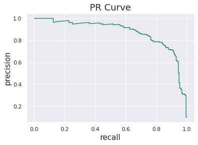

# Twitter hate detection

Use pretrained RoBERTa model from hugging face.

Fine tune on small corpora of tweets. Dataset is imbalanced with ~7% of hate tweets.

Got final quality: Accuracy 0.9722; Precision 0.8128; Recall 0.7639; **F1 0.7876**

And PR Curve:

